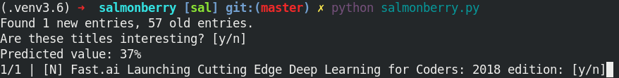

# Salmonberry

Machine learning powered RSS feed filtering



Inspiration:

* https://blog.algorithmia.com/create-your-own-machine-learning-powered-rss/
* http://scikit-learn.org/stable/auto_examples/model_selection/grid_search_text_feature_extraction.html


## Model accuracy

| Date | Model | Test dataset | l_2 test data error (k-fold cross-validation) | l_2 train data error |
| ---- | ----- | ------------ | --------------------------------------------- | -------------------- |
| 9.5.2018 | Tf-Idf + logistic regression | Random 50 reddit ML/AI articles | 40% +- (17% std) | 0% |
| 9.5.2018 | Tf-Idf + linear regression   | Random 50 reddit ML/AI articles | 42% +- (3% std)  | 0% |

* the *l_2 error* is defined as the the average euclidian distance between the predicted and target value. An error rate of 42% rougly means that 42 samples out of 100 are mislabeled.


To test model accuracy, run
```console
$ python accutest.py
```

## Changelog

| date     | changes |
| -------- | --------------------------------------- |
| 9.5.2018 | Added basic error estimation            |
| 8.5.2018 | Added article "niceness" predictions    |
| 7.5.2018 | Repo created, added basic rating system |


## Supported versions of python

* python 3.6 and newer
